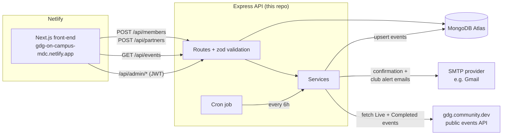

# GDG on Campus MDC — Back-End API

REST API that powers the website for the **Google Developer Group on Campus at Miami Dade College**.

It stores membership sign-ups and partnership inquiries, sends confirmation and notification emails, keeps the site's **Events** section in sync with the chapter's official page on [gdg.community.dev](https://gdg.community.dev/gdg-on-campus-miami-dade-college-miami-united-states/), and exposes a secure admin API used by the dashboard at `/admin` on the front-end.

- **Front-end repo:** [Google-Developers-Group-on-Campus-MDC-Front-End](https://github.com/Google-Developer-Group-MDC/Google-Developers-Group-on-Campus-MDC-Front-End)
- **Live site:** https://gdg-on-campus-mdc.netlify.app

---

## Table of contents

- [How it works](#how-it-works)
- [Tech stack](#tech-stack)
- [Project structure](#project-structure)
- [Getting started](#getting-started)
- [Environment variables](#environment-variables)
- [API reference](#api-reference)
- [Data models](#data-models)
- [Events sync](#events-sync-gdgcommunitydev)
- [Email notifications](#email-notifications)
- [Security](#security)
- [Testing](#testing)
- [Deployment](#deployment)

---

## How it works



1. **Visitors** fill out the *Become a Member* or *Partner With Us* forms. The front-end POSTs the data to the API, which validates it, stores it in MongoDB, and sends emails in the background: a welcome or thank-you email to the person, and an alert to the club inbox.
2. **Events** are not entered by hand. A cron job pulls the chapter's upcoming and past events from the gdg.community.dev API every 6 hours (and once on startup) and upserts them into MongoDB. The front-end reads them from `GET /api/events`.
3. **Club officers** log in at `/admin` on the website. With the JWT they get, they can:
   - review, search and filter members and partner inquiries
   - update their status and add internal notes
   - export them to CSV
   - trigger an events sync, hide or feature events, and add club-only events

## Tech stack

| Layer | Technology | Why |
| --- | --- | --- |
| Runtime | **Node.js** (ES modules) | Same language as the Next.js front-end |
| Web framework | **Express 5** | Minimal, well-known; native async error handling |
| Database | **MongoDB** + **Mongoose** | Flexible documents that map 1:1 to the form payloads; free tier on Atlas |
| Validation | **zod** | One schema validates, sanitizes (trim / lowercase) and produces per-field error messages for the forms |
| Auth | **jsonwebtoken** + **bcryptjs** | Stateless admin sessions; passwords hashed with bcrypt (cost 12) |
| Email | **Nodemailer** | Works with any SMTP provider (Gmail, Outlook, SendGrid, Resend SMTP…) |
| Scheduling | **node-cron** | Periodic events sync without external infrastructure |
| Security | **helmet**, **cors**, **express-rate-limit** | Secure headers, origin whitelist, brute-force and spam protection |
| Logging | **morgan** | HTTP request logs |
| Testing | **Jest**, **Supertest**, **mongodb-memory-server** | Full HTTP integration tests against a real in-memory MongoDB |
| Hosting | **Render** (API) + **MongoDB Atlas** (DB) | Free tiers; `render.yaml` blueprint included |

## Project structure

```
.
├── src/
│   ├── server.js              # Entry point: connects DB, starts cron + HTTP server
│   ├── app.js                 # Express app (middleware, routes) — imported by tests
│   ├── config/
│   │   ├── env.js             # Loads + validates environment variables (zod)
│   │   └── db.js              # MongoDB connection (falls back to in-memory DB in dev)
│   ├── models/                # Mongoose schemas: Member, Partner, Event, Admin
│   ├── validators/            # zod request schemas + shared option lists
│   ├── routes/                # public.js, auth.js, admin.js
│   ├── controllers/           # Request handlers
│   ├── middleware/            # auth (JWT), validate, rate limiting, error handling
│   ├── services/
│   │   ├── gdgEvents.js       # gdg.community.dev fetch → normalize → upsert
│   │   ├── email.js           # Nodemailer transport + HTML email templates
│   │   └── csv.js             # CSV export (with formula-injection protection)
│   ├── jobs/syncEvents.js     # Cron schedule for the events sync
│   └── utils/httpError.js
├── scripts/
│   ├── create-admin.js        # npm run create-admin
│   └── sync-events.js         # npm run sync-events
├── tests/                     # Jest + Supertest integration tests
├── .env.example
├── render.yaml                # Render deployment blueprint
└── package.json
```

## Getting started

### Prerequisites

- **Node.js 20+** (developed on Node 26)
- **npm**
- *(Optional)* a MongoDB connection string. Without one, development mode runs an in-memory MongoDB automatically.

### Run locally with no setup

```bash
git clone https://github.com/Google-Developer-Group-MDC/Google-Developers-Group-on-Campus-MDC-Back-End.git
cd Google-Developers-Group-on-Campus-MDC-Back-End
npm install
npm run dev
```

You should see:

```
⚠️  MONGODB_URI not set — using an in-memory MongoDB. Data will be lost on restart.
✅ MongoDB connected (gdg-mdc)
🔑 Dev admin created → email: admin@gdg-mdc.local  password: <random>
🚀 GDG MDC API listening on http://localhost:4000 (development)
🔄 Events sync (startup): 0 upcoming, 7 past, 0 removed
```

Use the printed dev-admin credentials to log in at `http://127.0.0.1:3000/admin` while the front-end is running locally (`npm run dev` in the front-end repo).

> The first run downloads a MongoDB binary (~75 MB) for the in-memory database. Later runs use the cached copy.

### Run with a persistent database

1. Create a free cluster on [MongoDB Atlas](https://www.mongodb.com/atlas). Then add a database user and allow your IP.
2. Copy the env template and fill in `MONGODB_URI`:
   ```bash
   cp .env.example .env
   ```
3. Create your first admin account:
   ```bash
   npm run create-admin -- you@example.com "a-strong-password" "Your Name"
   ```
   Running it again for the same email resets that admin's password.
4. Start the server:
   ```bash
   npm run dev
   ```

### npm scripts

| Script | Description |
| --- | --- |
| `npm run dev` | Start with auto-restart on file changes (`node --watch`) |
| `npm start` | Start in normal mode (used in production) |
| `npm test` | Run the Jest test suite |
| `npm run create-admin -- <email> <password> [name]` | Create or reset an admin account (requires `MONGODB_URI`) |
| `npm run sync-events` | One-off events sync from gdg.community.dev |

## Environment variables

See [`.env.example`](.env.example) for a commented template.

| Variable | Required | Default | Description |
| --- | --- | --- | --- |
| `PORT` | | `4000` | HTTP port |
| `NODE_ENV` | | `development` | `development`, `test` or `production` |
| `MONGODB_URI` | **prod** | *(in-memory in dev)* | MongoDB connection string |
| `JWT_SECRET` | **prod** | dev-only value | Secret used to sign admin tokens (16+ chars; use a long random string) |
| `JWT_EXPIRES_IN` | | `8h` | Admin session length |
| `CORS_ORIGINS` | | Netlify site + localhost:3000 | Comma-separated list of allowed front-end origins |
| `SMTP_HOST` | | *(empty = log only)* | SMTP server. When empty, emails are logged to the console instead of sent |
| `SMTP_PORT` | | `587` | `587` (STARTTLS) or `465` (SSL) |
| `SMTP_USER` / `SMTP_PASS` | | | SMTP credentials |
| `EMAIL_FROM` | | `GDG on Campus MDC <no-reply@example.com>` | Sender shown on outgoing emails |
| `CLUB_NOTIFY_EMAIL` | | | Inbox that receives new-member / new-partner alerts |
| `GDG_CHAPTER_ID` | | `2526` | Chapter ID on gdg.community.dev |
| `GDG_CHAPTER_URL` | | chapter page URL | Linked from the welcome email |
| `EVENTS_SYNC_CRON` | | `0 */6 * * *` | Cron expression for the auto-sync, or `off` |
| `ADMIN_EMAIL` / `ADMIN_PASSWORD` / `ADMIN_NAME` | | | Optional defaults for `npm run create-admin` (and the dev admin) |

## API reference

Base URL: `http://localhost:4000` locally, or your Render URL in production. All bodies are JSON.

Errors always have the shape `{ "error": "Human-readable message", "fields"?: { "<field>": ["message"] } }`.

### Public

| Method | Endpoint | Description |
| --- | --- | --- |
| `GET` | `/api/health` | Health check (`{ status, database, uptime }`) |
| `POST` | `/api/members` | Submit a membership sign-up. Returns `201`, `400` (validation) or `409` (email already registered) |
| `POST` | `/api/partners` | Submit a partnership inquiry. Returns `201` or `400` |
| `GET` | `/api/events?when=upcoming\|past\|all&limit=1-100` | List visible events. Upcoming are sorted soonest first, past newest first; featured events come first |
| `GET` | `/api/events/:id` | One event, including its full HTML description |

<details>
<summary><strong>Example: <code>POST /api/members</code></strong></summary>

```json
{
  "firstName": "Maria",
  "lastName": "Lopez",
  "email": "maria.lopez@mymdc.net",
  "phone": "(305) 555-1234",
  "major": "Computer Science",
  "year": "Junior",
  "interests": ["Web Development", "Cloud Computing"],
  "hearAboutUs": "Campus Event",
  "additionalInfo": ""
}
```

- **Required:** `firstName`, `lastName`, `email`, `major` and `year`.
- **Allowed values:**
  - `year`: Freshman, Sophomore, Junior, Senior, Graduate
  - `interests`: Web Development, Mobile Development, Artificial Intelligence / Machine Learning, Cloud Computing, Cybersecurity, Data Science, UI/UX Design
  - `hearAboutUs`: Social Media, Friend / Word of Mouth, Campus Event, Professor / Class, Flyer / Poster, Other
</details>

<details>
<summary><strong>Example: <code>POST /api/partners</code></strong></summary>

```json
{
  "companyName": "Acme Corp",
  "contactName": "Jane Doe",
  "email": "jane@acme.com",
  "phone": "305-555-9876",
  "website": "https://acme.com",
  "streetAddress": "300 NE 2nd Ave",
  "city": "Miami",
  "state": "FL",
  "zip": "33132",
  "partnershipInterest": "Event Sponsorship",
  "message": "We'd love to sponsor a hackathon."
}
```

- **Optional:** `website` and `message`. All other fields are required.
- **`partnershipInterest` values:** Event Sponsorship, Workshop / Speaker, Mentorship Program, Recruiting / Hiring, In-Kind Donation, Other
</details>

### Auth

| Method | Endpoint | Description |
| --- | --- | --- |
| `POST` | `/api/auth/login` | `{ email, password }` → `{ token, admin }` |
| `GET` | `/api/auth/me` | Current admin (requires token) |

### Admin (requires `Authorization: Bearer <token>`)

| Method | Endpoint | Description |
| --- | --- | --- |
| `GET` | `/api/admin/stats` | Counts of members, partners and events, broken down by status |
| `GET` | `/api/admin/members?search=&status=&page=&limit=` | Paginated, searchable member list |
| `GET` | `/api/admin/members/export.csv?search=&status=` | Download members as CSV |
| `GET` | `/api/admin/members/:id` | One member |
| `PATCH` | `/api/admin/members/:id` | Update `status` (`pending`, `active`, `inactive`) and/or `notes` |
| `DELETE` | `/api/admin/members/:id` | Delete a member |
| `GET` | `/api/admin/partners…` | Same routes as members. Partner `status` is `new`, `contacted`, `in-progress` or `closed` |
| `GET` | `/api/admin/events` | All events, including hidden ones |
| `POST` | `/api/admin/events` | Create a manual (club-only) event |
| `POST` | `/api/admin/events/sync` | Run the gdg.community.dev sync now |
| `PATCH` | `/api/admin/events/:id` | Edit a manual event. For synced events, only `hidden` and `featured` can be changed |
| `DELETE` | `/api/admin/events/:id` | Delete a manual event. Synced events can only be hidden |

## Data models

| Model | Key fields |
| --- | --- |
| **Member** | `firstName`, `lastName`, `email` (unique, lowercase), `phone`, `major`, `year`, `interests[]`, `hearAboutUs`, `additionalInfo`, `status`, `notes`, timestamps |
| **Partner** | `companyName`, `contactName`, `email`, `phone`, `website`, `streetAddress`, `city`, `state`, `zip`, `partnershipInterest`, `message`, `status`, `notes`, timestamps |
| **Event** | `source` (`gdg-community` or `manual`), `externalId` (gdg.community.dev id), `title`, `descriptionShort`, `description`, `startDate`, `endDate`, `timezone`, `audienceType`, `eventType`, `imageUrl`, `bannerUrl`, `url`, `location`, `hostChapter`, `tags[]`, `hidden`, `featured`, `lastSyncedAt` |
| **Admin** | `email` (unique), `name`, `passwordHash` (bcrypt, never returned), `lastLoginAt` |

## Events sync (gdg.community.dev)

The chapter page on gdg.community.dev runs on the Bevy platform, which exposes a public JSON API. The sync service ([`src/services/gdgEvents.js`](src/services/gdgEvents.js)) works like this:

1. It requests both event lists for chapter `2526`, following the API's `links.next` pagination:
   ```
   GET https://gdg.community.dev/api/event_slim/for_chapter/2526/?status=Live&include_cohosted_events=true&...
   GET https://gdg.community.dev/api/event_slim/for_chapter/2526/?status=Completed&include_cohosted_events=true&...
   ```
2. It **normalizes** each event: it maps fields to our schema and builds the location from the venue fields.
3. It **upserts** each event by its Bevy `id` (`externalId`). Content is overwritten, but admin-controlled `hidden` and `featured` flags are kept.
4. It **removes** synced events that no longer exist upstream. Manual events are never touched.

The sync runs on startup, on the `EVENTS_SYNC_CRON` schedule, from the admin dashboard ("Sync from GDG"), or via `npm run sync-events`. RSVPs stay on gdg.community.dev; the website links each event to its official page.

## Email notifications

| Trigger | Sent to | Content |
| --- | --- | --- |
| New member | The member | Welcome email + link to join the chapter on gdg.community.dev |
| New member | `CLUB_NOTIFY_EMAIL` | All submitted fields (reply-to = the member) |
| New partner inquiry | The contact | Thank-you / next-steps email |
| New partner inquiry | `CLUB_NOTIFY_EMAIL` | All submitted fields (reply-to = the contact) |

Emails are sent in the background, so a slow or failing SMTP server never blocks or fails the form submission. Failures are logged. When `SMTP_HOST` is empty, emails are only logged to the console.

**Using Gmail:**
1. Turn on 2-Step Verification for the account.
2. Create an [App Password](https://myaccount.google.com/apppasswords).
3. Set these variables:
   ```
   SMTP_HOST=smtp.gmail.com
   SMTP_PORT=587
   SMTP_USER=yourclubaccount@gmail.com
   SMTP_PASS=<16-character app password>
   EMAIL_FROM="GDG on Campus MDC <yourclubaccount@gmail.com>"
   CLUB_NOTIFY_EMAIL=yourclubaccount@gmail.com
   ```

## Security

- **Validation and sanitizing:** every request body is validated with zod. Unknown fields are stripped, strings are trimmed, and lengths are capped.
- **CORS:** only whitelisted origins (`CORS_ORIGINS`) can call the API from a browser.
- **Rate limiting:**
  - form submissions: 10 per 15 minutes per IP
  - login attempts: 10 per 15 minutes per IP
- **Spam protection:** a hidden `company_website` honeypot field is included. Bot submissions get a fake success response and are never stored.
- **Auth:** passwords are hashed with bcrypt. Admin routes need a signed JWT that expires (8h by default). There is no public sign-up; admins are created with the CLI script.
- **Headers:** `helmet` sets secure HTTP headers, and request bodies are limited to 100 kb.
- **CSV exports:** cells starting with `= + - @` are escaped to prevent spreadsheet formula injection.
- **Secrets:** they live only in environment variables. `.env` is git-ignored.

## Testing

```bash
npm test
```

The suites in `tests/` run the real Express app against an in-memory MongoDB, and they mock the gdg.community.dev API. They cover:

- **Forms:** member and partner submission, validation errors, duplicate emails and the honeypot.
- **Admin:**
  - login and route protection
  - listing, search, filters, updates, delete, CSV export and stats
- **Events:**
  - sync, normalization, keeping admin flags and removing deleted events
  - the public events filters, and the rules for manual vs. synced events
- **App:** CORS, JSON 404s and malformed JSON.

## Deployment

### 1. Database: MongoDB Atlas

1. Create a free M0 cluster.
2. Add a database user.
3. Allow access from `0.0.0.0/0`, since Render's free tier has no static IPs.
4. Copy the connection string.

### 2. API: Render

1. Push this repo to GitHub.
2. In [Render](https://render.com), click **New → Blueprint** and select this repo. [`render.yaml`](render.yaml) sets up the service.
3. Fill in the secret env vars when prompted: `MONGODB_URI`, the SMTP settings, `EMAIL_FROM` and `CLUB_NOTIFY_EMAIL`. `JWT_SECRET` is generated automatically.
4. After the first deploy, open the service **Shell** and create an admin:
   ```bash
   npm run create-admin -- officer@example.com "a-strong-password" "Officer Name"
   ```
   You can also run the same command locally with `MONGODB_URI` pointing at the Atlas cluster.

> Render free instances sleep after ~15 minutes of inactivity, so the first request after a sleep takes ~30–50 s. Upgrade the plan or use an uptime pinger on `/api/health` if that matters.

Other Node hosts (Railway, Fly.io, a VPS) work the same way: run `npm ci --omit=dev && npm start` with the env vars set.

### 3. Front-end: Netlify

1. In the Netlify site settings, go to **Environment variables**.
2. Add `NEXT_PUBLIC_API_URL=https://<your-render-service>.onrender.com`.
3. Redeploy.
4. Make sure the Netlify URL is listed in the API's `CORS_ORIGINS`.

---

Built by the GDG on Campus MDC team.
